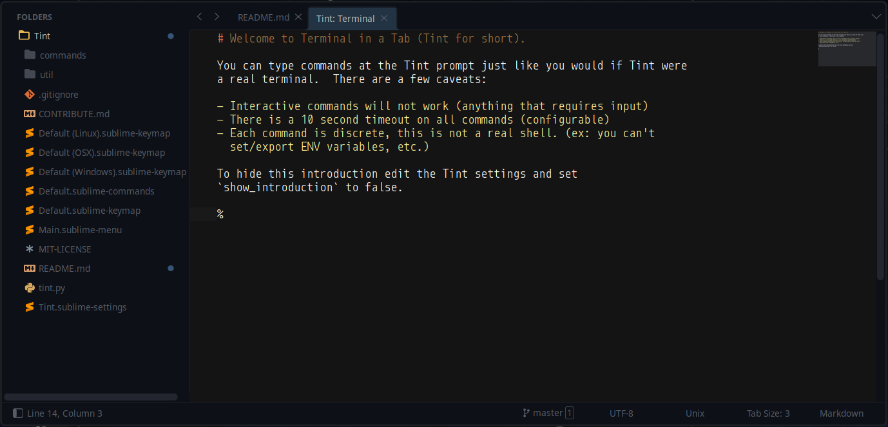

# Tint, a lightweight terminal in a tab

## Why?

First, I wanted to see if it could be done.  Then it started becoming useful.

### Run your own commands directly from the picker

Just make your own `.sublime-commands` file like so:

    {
        "caption": "git: status",
        "command": "tint_run_custom",
        "args": {
            "cmd": "git status" }
    }

Custom commands first open a new Tint terminal and then run the command you specify inside that terminal.

## Caveats

 - no interactive commands (ie, no input from terminal)
 - piping should work just fine though (grep, etc.)
 - doesn't work on Windows

